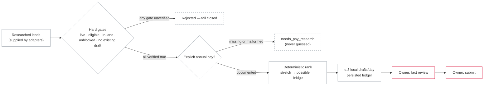

<div align="center">

# career-ops

**A deterministic, local-first queue that prepares at most three
job-application drafts a day — and is structurally unable to submit any of
them.**

[](https://github.com/insomniac-asif/career-ops/actions/workflows/ci.yml)
[](pyproject.toml)
[](tests/)
[](pyproject.toml)
[](LICENSE)

</div>

This is deliberately **not** an auto-submit bot. Restraint is the feature.

## Why this exists

I'm job hunting, and I build agents. The obvious move — wire the two together
and let a bot spray applications — is the one I refused to make. An
application carries my name and my claims; the moment software submits one I
haven't read, I've published something I can't vouch for.

So Career Ops automates only the work that cannot misrepresent me: gating
leads on verified facts, classifying *documented* pay, ranking a bounded
queue, and preparing at most three local draft packages per day. Everything
consequential — facts, messages, money, the submit button — stays owner-only
by construction, not by configuration. The cap isn't rate-limiting for
politeness; three drafts is what I can honestly review in a day.

## The pipeline



- **Gates fail closed.** A lead enters the queue only when every check is
  explicitly verified: posting live, work eligibility true, research not
  blocked, a configured role lane, and no existing draft. Unknown is treated
  as no.
- **Salary is never guessed.** Missing or malformed compensation lands in
  `needs_pay_research` and cannot enter the automatic queue. Tiers come from
  documented annual figures only: stretch confirmed (minimum ≥ $120k),
  stretch possible (range reaches $120k), bridge (range reaches the $55k
  floor).
- **Ranking is deterministic.** Pay tier, then lane priority, then recency,
  then score, then lead id. Same input, same queue, every time.
- **The cap survives restarts.** A JSON ledger (written atomically:
  temp file, `fsync`, `os.replace`, mode `0600`) makes the three-draft cap
  idempotent across runs. Failed attempts don't consume a success slot and
  are not retried the same day. A new day resets the counters but preserves
  whether the owner enabled auto-prep. Disabling mid-run stops before the
  next draft.

## Run it in two minutes

The engine and CLI are pure standard library — nothing to install.

```bash
# rank the synthetic fixture and print the plan
python career_ops_cli.py plan examples/leads.synthetic.json

# write local draft receipts to .career-ops/demo.json; submits nothing
python career_ops_cli.py simulate examples/leads.synthetic.json

# inspect the ledger
python career_ops_cli.py status examples/leads.synthetic.json

# tests (pytest is the only dependency, and only for tests)
python -m pip install pytest
pytest -q
```

The fixture is entirely synthetic: 7 leads, of which exactly 3 survive the
gates:

```text
1. Northstar Systems — stretch confirmed  ($130k–$155k documented)
2. Lantern Works     — stretch possible   ($105k–$135k documented)
3. Harbor Desk       — bridge             ($65k–$85k documented)
```

The rejections are the point: the fixture's best-looking lead — top score
*and* top pay ($180k–$220k) — is refused because research flagged it blocked,
and its second-highest scorer is refused because its pay is undocumented.
Running `simulate` twice prepares nothing new — the ledger already holds the
day's three receipts.

## Core contract

| Capability | Authority |
|---|---|
| Discover and research leads | Automated elsewhere — out of scope here |
| Rank and queue verified leads | Automated |
| Prepare local draft packages | Automated when enabled, max 3/day |
| Guess missing compensation | Never |
| Submit an application | Human owner only |
| Send a message | Human owner only |
| Spend money or trade | Human owner only |

This table mirrors the `AUTHORITY` dict in [`career_ops.py`](career_ops.py) —
a single stdlib-only module (~400 lines) whose imports are `json`, `math`,
`os`, `tempfile`, `threading`, `time`, `datetime`, `typing`. No browser
driver, email client, job-board integration, or network dependency exists in
the core, and a test enforces that by parsing the module's AST.

## Verification

17 test functions across four files cover: the cap and its idempotency,
two-tier ordering, every fail-closed gate, failure-does-not-consume-a-slot
and no same-day retry, the daily reset, disabling mid-run, malformed state
failing disabled, CLI receipts and exit codes, the static demo page, and the
public privacy boundary (no network/browser/email imports in the core; no
email addresses or phone numbers anywhere in tracked text). One demo test
skips when `node` is unavailable.

The suite is built to reject mutants, not just to pass: raising the cap to
four trips `test_cap_above_three_is_rejected`, and bypassing the blocked-lead
gate trips `test_fail_closed_filters_every_unverified_or_already_handled_path`.

GitHub Actions runs the suite on Python 3.11, 3.12, and 3.13, byte-compiles
both modules, and replays the deterministic demo plan on every push.

## The demo

[`docs/index.html`](docs/index.html) is a self-contained static page (inline
CSS/JS, strict CSP, zero external requests) that replays the synthetic queue
and states the boundary. `tests/test_docs.py` audits it — the page must
literally say "Zero blind submissions" and declare itself a synthetic public
demonstration to pass. A second workflow publishes it to GitHub Pages
whenever `docs/` changes reach `main`.

## Limitations

- **This is the governance half, not the discovery half.** Nothing here
  scrapes, browses, or finds jobs. Adapters supply already-researched leads;
  the gates check their verification flags but cannot verify the underlying
  facts.
- **The thresholds are my numbers.** $120k stretch / $55k bridge are module
  constants. `classify_pay` accepts overrides, but the CLI does not expose
  them.
- **An in-flight draft cannot be force-killed.** Disabling during a run stops
  before the *next* draft; the current generator callback runs to completion,
  and the state file records exactly that.
- **A failed lead waits until tomorrow.** No same-day retry is deliberate,
  but it means one transient failure costs that lead a day.
- **One machine, one process.** The run lock is per-process and the ledger is
  a local file. Two separate processes racing could each generate drafts even
  though the ledger only records three successes — don't run two.

## Repository map

```text
career_ops.py                 deterministic queue + state ledger (stdlib only)
career_ops_cli.py             plan / simulate / status interface
examples/leads.synthetic.json public-safe demonstration data (7 leads)
tests/                        behavior, CLI, demo, and privacy-boundary tests
docs/index.html               zero-dependency static demo
.github/workflows/            CI matrix + Pages deployment
```

## Design boundary

This project assists with organization and document preparation. Automated
job submission can create inaccurate representations, violate site rules, and
remove the applicant from consequential decisions. Career Ops therefore ends
at a review-ready local draft receipt: the owner supplies truthful facts and
makes every final submission. [`CONTRIBUTING.md`](CONTRIBUTING.md) rules
changes that weaken fail-closed behavior or raise the cap out of scope.

MIT licensed. See [SECURITY.md](SECURITY.md) for the threat model and
privacy rules.

---

Part of [Absent Born Labs](https://absentbornlabs.org) · more at [github.com/insomniac-asif](https://github.com/insomniac-asif)
