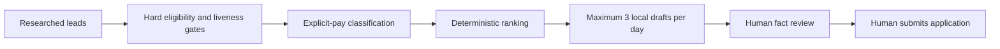

# Career Ops

[](https://github.com/insomniac-asif/career-ops/actions/workflows/ci.yml)
[](https://www.python.org/)
[](LICENSE)

A local-first control plane that turns a noisy lead backlog into a small,
evidence-backed preparation queue. It prioritizes stretch roles toward
`$120k/year`, keeps a `$55k/year` bridge lane, and allows no more than three
successful local draft packages per day.

**It is deliberately not an auto-submit bot.** Research and local preparation
can be automated; factual review, messages, spending, and final application
submission stay with the human owner.

[Open the recruiter-sized demo](https://insomniac-asif.github.io/career-ops/)

## Why this exists

Most job automation optimizes volume. Career Ops optimizes bounded throughput
and evidence quality:

- Hard gates run before ranking: the posting must be live, eligibility must be
  verified, the role must fit a configured lane, and no draft may already exist.
- Salary is never guessed. Missing or malformed pay stays in
  `needs_pay_research` and cannot enter the automatic queue.
- The queue is deterministic: confirmed stretch, possible stretch, then bridge;
  role priority and recency break ties.
- A persisted daily ledger makes the three-draft cap idempotent across restarts.
- Failed items do not consume a success slot and are not retried repeatedly on
  the same day.



## Run it in two minutes

No runtime dependencies are required.

```bash
python career_ops_cli.py plan examples/leads.synthetic.json
python career_ops_cli.py simulate examples/leads.synthetic.json --state .career-ops/demo.json
python -m pip install pytest
pytest -q
```

The fixture is entirely synthetic. `simulate` records local draft receipts; it
does not browse, contact an employer, or submit anything.

Expected queue:

```text
1. Northstar Systems — stretch confirmed
2. Lantern Works — stretch possible
3. Harbor Desk — bridge
```

## Core contract

| Capability | Authority |
|---|---|
| Rank and queue verified leads | Automated |
| Prepare local draft packages | Automated when enabled, max 3/day |
| Guess missing compensation | Never |
| Submit an application | Human owner only |
| Send a message | Human owner only |
| Spend money or trade | Human owner only |

The reusable engine is a single auditable module: [`career_ops.py`](career_ops.py).
Adapters supply researched lead records and a local draft callback. The core has
no browser driver, email client, job-board integration, or network dependency.

## Verification

The test suite checks the cap, two-tier ordering, fail-closed gates, daily reset,
idempotency, retry behavior, malformed state handling, CLI receipts, and the
public privacy boundary. During development, two deliberate mutants—raising the
cap to four and bypassing the blocked-lead gate—were both rejected by the tests.

GitHub Actions runs the suite on Python 3.11, 3.12, and 3.13. A second workflow
publishes the static demo from `docs/` after changes reach `main`.

## Repository map

```text
career_ops.py                 deterministic queue + state ledger
career_ops_cli.py             plan/status/simulate interface
examples/leads.synthetic.json public-safe demonstration data
tests/                        behavior, CLI, and privacy tests
docs/index.html               zero-dependency GitHub Pages demo
.github/workflows/            CI and Pages deployment
```

## Design boundary

This project assists with organization and document preparation. Automated job
applications can create inaccurate representations, violate site rules, and
remove the applicant from consequential decisions. Career Ops therefore ends at
a review-ready local draft receipt. The owner supplies truthful facts and makes
the final submission.

MIT licensed. See [SECURITY.md](SECURITY.md) for the privacy model.
